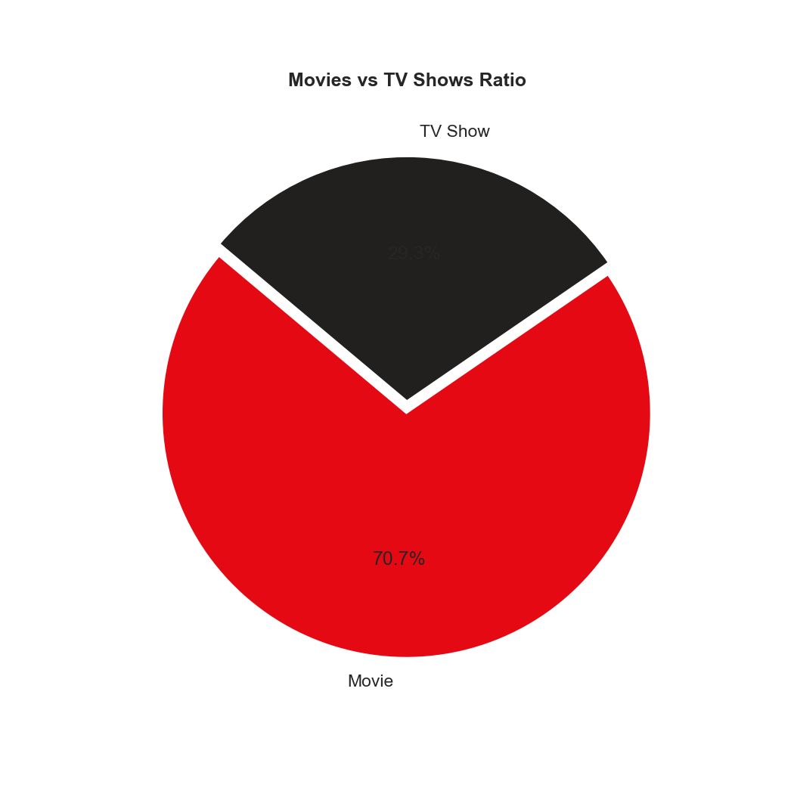
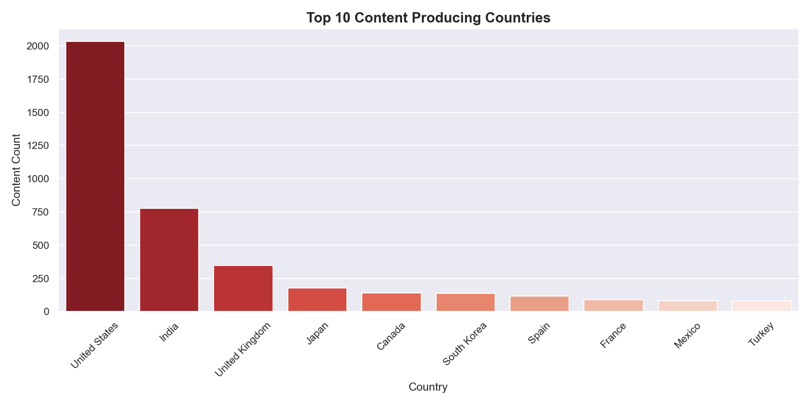
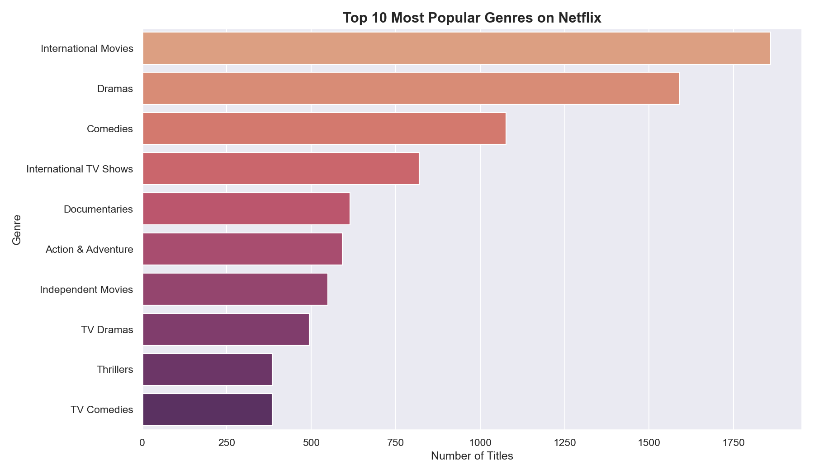
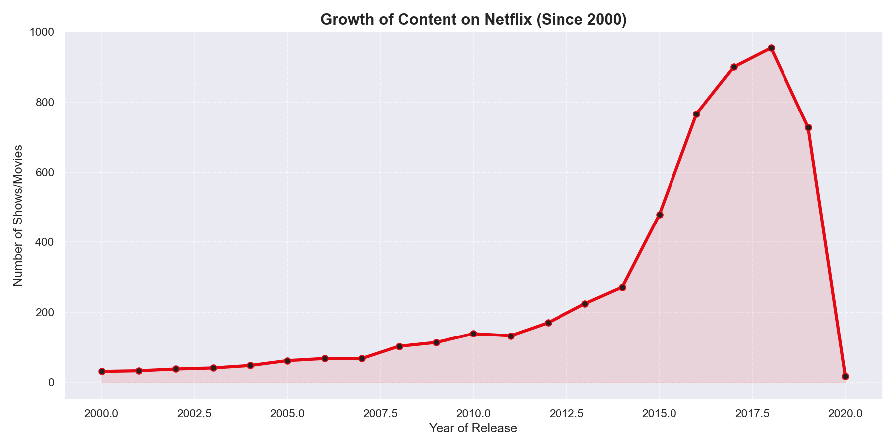

# 🎬 Netflix Data Analysis

A simple data analysis project exploring Netflix's catalog of movies and TV shows. This project visualizes trends in content types, production countries, genres, and growth over time.

## 📊 Visualizations

### 1. Content Type Distribution
Analysis of the ratio of Movies to TV Shows on the platform.


### 2. Top Production Countries
Identifying the leading nations in Netflix content production.


### 3. Top Genres
Mapping the most prevalent genres in the catalog.


### 4. Content Growth Trend
Tracking the evolution of content production volume over the years.


## 🛠️ Tools Used
- **Python**: Core programming language.
- **Pandas**: For data manipulation and analysis.
- **Matplotlib & Seaborn**: For creating the visualizations.

## 📁 Project Structure
```text
netflix-analysis/
├── netflix.csv           # Original dataset
├── analysis.py           # Python script for analysis
├── analysis.ipynb        # Jupyter Notebook version
└── plots/                # Exported visualizations
```

## 🚀 How to Run
1. Install dependencies: `pip install pandas matplotlib seaborn`
2. Run the script: `python analysis.py`
